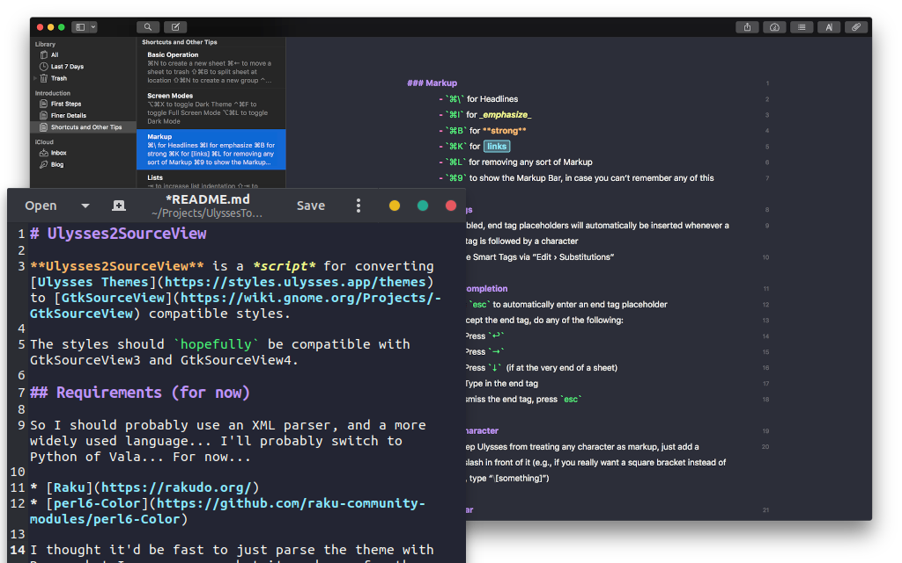

# Ulysses2SourceView

**Ulysses2SourceView** is a *script* for converting [Ulysses Themes](https://styles.ulysses.app/themes) to [GtkSourceView](https://wiki.gnome.org/Projects/GtkSourceView) compatible styles.

If you're writing in Markdown, I highly recommend [Ulysses](https://ulysses.app) if you're using a Mac or iPad. It's my favorite Markdown editor.

The styles should `hopefully` be compatible with GtkSourceView3 and GtkSourceView4.



A sample of converting [Dracula](https://github.com/dracula/ulysses), but they already have a [gEdit style](https://github.com/dracula/gedit).

## Requirements (for now)

So I should probably use an XML parser, and a more widely used language... I'll probably switch to Python of Vala... For now...

* [Raku](https://rakudo.org/)
* [perl6-Color](https://github.com/raku-community-modules/perl6-Color)

I thought it'd be fast to just parse the theme with Regex, but I was wrong... but it works... for the most part...

## Converting the Theme

First, extract the Theme.xml from the Ulysses theme package. Then run `./ulysses2sourceview Theme.xml Output.xml`. Add the Theme in gEdit.

```
Usage:
  ./ulysses2sourceview [--dark] <input-file> <output-file>
  
    <input-file>     a Ulysses theme to convert
    <output-file>    name of location to write output to
    --dark           Convert dark mode instead of light
```

## Known Issues

There's some magic numbers and strings that I have no idea what they do... so we just did stuff to them until themes looked okayish. If you want the theme to work well, I highly recommend [Ulysses](https://ulysses.app).

